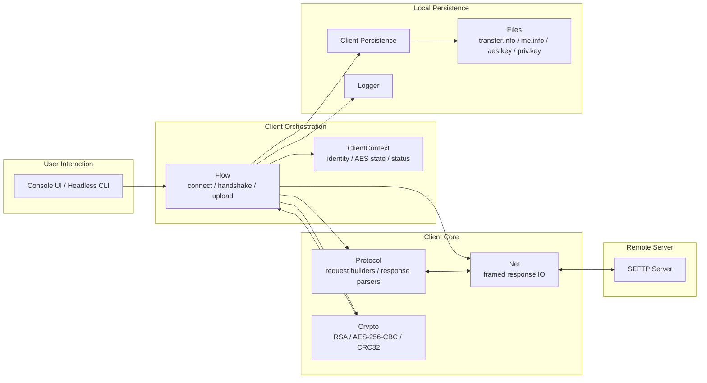

# Client Design

## 1. Purpose and Scope

The client is the stateful frontend of the secure file transfer system. It is responsible for loading connection and identity configuration, establishing a TCP connection to the server, executing the registration or relogin handshake, managing local persistent identity material, encrypting files before upload, sending protocol-compliant request frames, interpreting server responses, and coordinating CRC-based upload completion.

The current client is implemented in C++ and is built around a custom binary protocol, Crypto++-based cryptographic operations, Boost.Asio networking, file-based local persistence, and two operating modes: interactive console mode and headless CLI batch mode.

The current scope includes:
- loading server address and username from `transfer.info`
- first-time registration and key bootstrap
- relogin using persisted client identity
- local persistence of client identity, private key, and AES session key
- RSA key generation and AES key decryption
- AES-256-CBC file encryption with a per-file IV
- chunked file upload over the custom binary protocol
- CRC-based completion, retry, and failure signaling
- interactive console UI and headless multi-file execution
- structured client-side logging
- Stage 7 server-identity handshake before registration, relogin, and upload flows
- server signature verification over the handshake transcript
- TOFU and optional pinned server fingerprint validation
- AES key binding verification for `1602` / `1605` before AES key decryption and persistence

The current scope does not include:
- GUI-based client interaction
- resumable uploads across reconnects
- background job management
- multi-server failover
- concurrent uploads from the same client process
- advanced secure local key storage beyond local files
- a generalized SDK-style API surface for external applications

## 2. High-Level Architecture

At a high level, the client loads runtime configuration from `transfer.info`, initializes a `ClientContext`, connects to the server through `Boost.Asio`, executes the Stage 7 server-identity handshake, performs either first-time registration or relogin, loads the AES key needed for uploads, and sends files through a streaming upload pipeline. During upload, the client reads plaintext incrementally, updates CRC32 incrementally, encrypts with continuous AES-256-CBC state, packetizes ciphertext into 828 chunks, and then finalizes the upload based on the CRC result returned by the server.

The client is split into a small set of clear layers:
- `flow` orchestrates connection, handshake, and upload sequences
- `protocol` defines request builders and response parsers
- `net` performs framed response IO
- `crypto` handles key generation, AES encryption/decryption, Base64 conversion, and CRC
- `persistence` and `files` manage local durable state
- `console_ui` provides interactive control flow
- `logger` provides lightweight structured logging

This structure keeps protocol details, cryptographic logic, local persistence, and user interaction separate enough to evolve independently.

### Protocol Frame Shape

The client operates on a strict binary request/response model:

```text
Request:
[16B client_id][1B version][2B code][4B payload_size][payload]

Response:
[1B version][2B code][4B payload_size][payload]
```

The client builds outgoing frames through `protocol.hpp` and reads incoming response frames through `net.hpp` and `net.cpp`.



## 3. Major Components

### 3.1 Client Entrypoint

`client_main.cpp` is the main orchestration entrypoint. It parses CLI options, loads transfer.info, initializes logging, creates the socket and resolver, and chooses between headless multi-file mode and interactive console mode.

The entrypoint also owns the top-level handshake path through `seftp::flow::connect_and_handshake(...)` and ensures that socket shutdown and final client summary printing are handled consistently.

### 3.2 Client Context and Configuration

client_types.hpp defines the lightweight runtime state used across the client:

- `ClientContext` stores the current client identity, username, AES key state, and error/flow flags
- `ClientConfig` stores the server host, port, and username
- `DispatchResult` and `NextStep` encode handshake decisions such as whether the client must register, resend a public key, or fail

This keeps cross-cutting runtime state explicit instead of scattering it across unrelated functions.

### 3.3 Flow Layer

`flow.hpp` together with orchestration logic implemented in `client_main.cpp` act as the orchestration layer. This is the most important control-plane layer on the client side.

It owns three high-level responsibilities:

- connect and handshake with the server
- disconnect the socket cleanly
- send a single file using the active AES key and current client identity

The key design point here is that flow does not redefine protocol or crypto primitives. Instead, it composes them into end-to-end client behavior.

Before the registration or relogin flow begins, the flow layer executes the Stage 7 server-identity handshake. This sends `829 CLIENT_HELLO`, receives and validates `1608 SERVER_HELLO`, verifies the server signature and trust model, sends `830 CLIENT_HANDSHAKE_ACK`, and only then continues to the existing 825/827/826 flow.

### 3.4 Protocol Layer

`protocol.hpp` defines the wire-level protocol model. It contains:

- request and response code enums
- little-endian helpers
- request frame builders for `825`, `826`, `827`, `828`, `829`, `830`, `900`, `901`, and `902`
- payload layout helpers for `packet 0`, chunk packets, CRC result messages, and Stage 7 handshake messages
- typed response parsers for `1600`, `1602`, `1603`, and `1608`

This is a strong design choice because it keeps binary framing logic out of the UI, flow, and crypto code. The client therefore has a single protocol definition point for request construction and response interpretation.

### 3.5 Networking Layer

`net.hpp` and `net.cpp` handle response-frame IO. The networking layer reads exactly the response header size, validates payload length against a maximum, reads the remaining payload, and returns a typed `ResponseFrame`.

This keeps socket IO and frame-boundary correctness separate from higher-level handshake logic. It also gives the client a single narrow point for server-response reading instead of duplicating framed reads throughout the code.

### 3.6 Cryptography Layer

`crypto.hpp` and `crypto.cpp` implement the cryptographic operations used by the client:

- RSA-2048 keypair generation
- Base64 encode/decode helpers
- random IV generation per file
- AES-256-CBC file encryption and decryption
- incremental AES-256-CBC upload encryption with file-level PKCS#7 padding
- CRC32 computation
- RSA-OAEP decryption of the server-sent AES key
- SHA-256 server fingerprint calculation
- RSA signature verification for Stage 7 `SERVER_HELLO`
- RSA signature verification for Stage 7 AES key binding responses (`1602` / `1605`)
This layer is used in two different phases:

- handshake phase, where the client generates or loads an RSA keypair and decrypts the server-issued AES key
- upload phase, where the client encrypts a file with AES-256-CBC using a fresh IV per file

The main design strength is that cryptographic primitives are kept out of the UI and mostly out of the raw networking code.

### 3.7 Local Persistence Layer

The client has a local persistence model built around a few durable files:

- `transfer.info` stores server address, username, and optionally a default file path
- `me.info` stores username and persistent client ID, and may also include the public key in Base64
- `aes.key` stores the current AES key in Base64
- `priv.key` stores the binary RSA private key

`files.hpp` and `files.cpp` implement low-level file reads and atomic writes. `client_persistence.hpp` and `client_persistence.cpp` wrap those file operations into higher-level identity loading and saving operations.

This is an important boundary: raw file mechanics are separated from identity semantics.

### 3.8 Console UI

`console_ui.hpp` and `console_ui.cpp` implement an interactive text UI. The UI is intentionally thin. It does not implement crypto or protocol logic itself. Instead, it:

- displays client status
- triggers connect or reconnect
- triggers single-file send
- triggers batch send
- reports status and error text from the orchestration layer

That keeps the UI replaceable. A future GUI could reuse the same underlying flow, protocol, persistence, and crypto layers.

### 3.9 Logging

`logger.hpp` and `logger.cpp` implement a lightweight singleton logger with runtime-selectable verbosity. The logger supports `Error`, `Warn`, `Info`, and `Debug` levels and prints timestamped messages to `stdout` or `stderr`.

The logging layer is intentionally simple, but it is enough to make the client understandable during handshake and transfer flows.

## 4. Request and Data Flows

### 4.1 Configuration Load Flow

The client starts by reading transfer.info. The expected content is:

- first line: `host:port`
- second line: username
- optional third line: file path

This gives the client its initial target server and logical user identity before any local persisted identity is loaded.

### 4.2 First-Time Registration Flow

If no stored identity can be loaded, the client follows the first-time registration path:

- send request `825` with the configured username
- receive response `1600` containing the server-issued persistent client ID
- generate a new RSA-2048 keypair
- persist the private key locally
- send request `826` with username and public key
- receive response `1602` containing the encrypted AES key and echoed client ID
- decrypt the AES key using the stored private key
- persist the AES key locally

This establishes both the stable client identity and the current symmetric encryption key needed for uploads.

### 4.3 Relogin Flow

If a stored identity exists, the client attempts relogin:

- load username and client ID from local persistence
- verify that the stored username matches the username in `transfer.info`
- send request `827`
- if the server returns `1605`, decrypt and persist the new AES key
- if the server indicates that registration or public-key resubmission is needed, fall back into the appropriate recovery path

This is a strong design choice because the client does not assume relogin must always succeed. It supports controlled fallback into re-registration or key resubmission when needed.

### 4.4 AES Key Bootstrap Flow

The AES key is not generated by the client. It is generated by the server and delivered encrypted under the client's RSA public key. For Stage 7 `security_version = 1`, the server also signs the AES key response and binds it to the current handshake transcript.

The client:

- receives the bound AES key response in `1602` or `1605`
- verifies the AES key binding signature using the verified server public key
- rejects the response if the signature is invalid
- decrypts the encrypted AES material using `priv.key`
- verifies the expected AES key size
- stores the Base64 form in `aes.key`

This means the client is responsible for key recovery and local key persistence, but not for symmetric key generation policy.

### 4.5 File Upload Flow

Once connected and holding an AES key, the client sends a file through a streaming upload pipeline:

- determine the plaintext file size from disk
- compute the expected AES-CBC ciphertext size after PKCS#7 padding
- generate a fresh 16-byte IV for the file
- send request `828` packet `0` containing metadata and the IV
- read plaintext from disk incrementally
- update CRC32 incrementally over plaintext
- encrypt only full AES blocks using continuous AES-256-CBC state
- keep a small pending plaintext tail until enough bytes exist to form full blocks
- apply PKCS#7 padding only once at end-of-file
- buffer produced ciphertext until protocol packet boundaries are reached
- send request `828` packets `1..N` containing ciphertext chunks
- receive response `1603` containing the server-side CRC result
- compare and complete the CRC outcome flow

This is intentionally still a file-level AES-CBC model. Protocol chunks are transport chunks only. They are not independently encrypted, padded, authenticated, retried, or resumable units.

This design keeps plaintext off the wire while avoiding full-file plaintext or full-file ciphertext buffering on the client.

### 4.6 CRC Completion Flow

After receiving 1603, the client decides how to finalize the upload:

- send `900` if the CRC is valid
- send `901` if the CRC mismatched but another retry path is still available
- send `902` if CRC mismatch handling is exhausted

This means upload success is not just "last chunk sent". Success is an explicit protocol-level conclusion based on CRC agreement.

### 4.7 Headless and Interactive Execution Flow

The client supports two operating modes:

- interactive mode through `console_ui`
- headless mode through CLI-provided file paths

In headless mode, the client performs a single connect-and-handshake step and then sends multiple files sequentially. In interactive mode, the user can connect, inspect status, send a single file, or send a batch.

This is a useful product-level choice because it makes the same client usable both for demos and for scripted runs.

## 5. Persistence Model

The client persistence model is intentionally simple and file-based.

### 5.1 Durable State

The following information is persisted across runs:

- logical identity in `me.info`
- current AES key in `aes.key`
- RSA private key in `priv.key`
- trusted server fingerprint in `server.fingerprint`
- optional pinned server fingerprint in `server.pin`

This lets the client preserve a stable identity, reuse its private key, and perform relogin instead of repeating full registration on every run.

### 5.2 Server Trust Persistence

Stage 7 adds two local trust files:

- `server.fingerprint`
- `server.pin`

If `server.pin` exists, the client uses pinned mode and requires the server fingerprint to match the pinned value exactly. The client never creates `server.pin` automatically because a pin must come from an external trusted source.

If `server.pin` does not exist, the client uses TOFU. On first successful server signature verification, the client stores `SHA-256(server_public_key_der)` in `server.fingerprint`. On later connections, the fingerprint must match or the connection fails closed.

### 5.3 Atomic File Updates

`files.cpp` uses atomic write behavior for identity, AES-key, and server-fingerprint writes by writing to a temporary file and then renaming it into place.

This is a small but mature design choice. Even though the client is local and simple, persistence is not treated as "best effort".

### 5.4 Separation Between Raw Files and Semantic Persistence

Low-level file mechanics live in `files.*`, while `client_persistence.*` exposes higher-level persistence concepts such as:

- loading stored identity
- loading a private key
- loading an AES key

This prevents the rest of the client from becoming tightly coupled to on-disk file layout details.

## 6. Concurrency and Execution Model

The client is primarily single-flow and synchronous in behavior from the user's perspective. It uses `Boost.Asio` sockets, but the current design does not attempt to upload multiple files concurrently or maintain multiple simultaneous server sessions.

This is appropriate for the current project scope because the client is modeling a deterministic secure transfer flow, not a high-throughput multi-session uploader.

The main execution model is:

- connect
- handshake
- load AES state
- send one or more files sequentially
- finalize uploads based on CRC responses
- disconnect

This keeps client behavior easy to reason about and avoids introducing concurrency complexity where it is not yet justified.

## 7. Validation, Error Handling, and Safety Boundaries

The client validates several critical boundaries:

- persisted username must match `transfer.info`
- client ID must be parseable and structurally valid
- decrypted AES key must have the expected size
- RSA material must load correctly
- response payloads must match expected protocol formats
- file paths must exist and be readable before upload
- response payload sizes are capped by the networking layer

The client also treats protocol responses as authoritative. It does not assume that a sent request succeeded until the corresponding valid server response is parsed.

Another important safety boundary is local encryption before upload. Files are encrypted client-side with AES-256-CBC using a fresh IV per file. This prevents plaintext file contents from being transmitted directly.

## 8. Key Design Decisions and Tradeoffs

### 8.1 C++ Client

The client is implemented in C++, which is appropriate for a binary protocol client that integrates low-level byte handling, explicit file processing, Boost.Asio socket IO, and Crypto++-based cryptography. This gives strong control over protocol representation and binary data flow.

The tradeoff is higher implementation complexity compared to a scripting-language client.

### 8.2 Thin UI, Thick Orchestration

The design intentionally keeps `console_ui` thin and pushes actual behavior into flow, protocol, crypto, and persistence. This is the right separation because UI code tends to become unstable if it starts owning transport or cryptographic behavior.

The tradeoff is that some orchestration functions become larger and more central.

### 8.3 Protocol Builders and Parsers in One Place

protocol.hpp centralizes request construction and typed response parsing. This is a strong maintainability choice because protocol changes can be handled in one place rather than being duplicated across business logic.

The tradeoff is that `protocol.hpp` becomes a dense header and a central dependency.

### 8.4 File-Based Local Persistence

The client stores identity and key material in local files instead of using an embedded database or OS-specific secure storage. For the current project, this is a reasonable tradeoff: simple, portable, and easy to inspect.

The tradeoff is that secure storage guarantees are limited compared to platform-native credential stores.

### 8.5 Sequential Multi-File Sending

In headless mode, the client sends files sequentially after one handshake rather than opening separate sessions or uploading concurrently. This reduces complexity and avoids overlapping protocol state on the client side.

The tradeoff is lower throughput if many files need to be uploaded.

### 8.6 Local Encryption Before Transport

The client encrypts file contents before they cross the network rather than sending plaintext to the server for server-side encryption. In Stage 7, this is implemented as a streaming encryption pipeline instead of full-file pre-encryption. The client reads plaintext incrementally, updates CRC32, encrypts with continuous AES-CBC state, and sends ciphertext in protocol chunks.

The tradeoff is that the client still bears the encryption cost and must manage IVs, AES key material, CBC state, padding boundaries, and packetization correctly.

### 8.7 Fallback-Based Handshake Recovery

The handshake flow is not rigidly optimistic. If relogin fails in specific ways, the client can fall back into registration or public-key submission paths. This improves robustness and makes persisted identity recovery less brittle.

The tradeoff is a more complex handshake state machine compared to a strictly linear login path.

## 9. Configuration Model

The client configuration model is intentionally simple.

`transfer.info` provides:

- server host and port
- logical username
- optionally a file path hint

CLI arguments can additionally enable:

- debug mode selection
- headless batch file sending

This split is practical:

- `transfer.info` acts as stable runtime configuration
- CLI arguments act as execution-time overrides or mode selectors

## 10. Local Observability and Operational Behavior

The client includes a lightweight but useful observability model through:

- timestamped logs
- explicit error text propagation through `ClientContext`
- UI-visible last status and last error state
- headless batch progress logging

This is enough to understand where failures occur during connect, handshake, file preparation, upload, or CRC completion, even without a more advanced tracing system.

## 11. Current Architectural Findings

The client architecture is built around a clear assumption: the most important property is correctness of the end-to-end secure transfer flow, not client-side concurrency or UI richness.

That assumption shows up directly in the design:

- protocol construction is explicit and centralized
- local persistence is simple but durable enough
- encryption happens before transport
- handshake recovery is explicit
- upload completion is CRC-driven rather than assumed

Another clear architectural property is replaceability of the outer layer. Because UI, flow, protocol, crypto, networking, and persistence are reasonably separated, the client could later gain a GUI or another control surface without rewriting the protocol and crypto foundation.

## 12. Limitations and Future Work

This client is already solid for the current project scope, but several future directions are clear.

A GUI client could be added on top of the existing lower layers. The current separation between UI and orchestration makes that realistic.

Local key storage could be improved. Today, `priv.key` and `aes.key` are file-based. A future version could integrate platform-specific secure storage mechanisms.

The upload execution model could evolve. Right now, multi-file sending is sequential. Future work could evaluate whether controlled parallel uploads are worth the extra protocol and state complexity.

The streaming upload implementation currently lives close to the main orchestration entrypoint. A future cleanup could extract the upload pipeline into a dedicated client upload module to reduce `client_main.cpp` size and improve testability.

Progress reporting could also improve. The client already logs activity, but richer progress reporting and more structured status output would improve usability.

Finally, the orchestration code could be reduced further by moving more request/response handling into dedicated flow implementation files rather than keeping significant behavior close to the main entrypoint.

## 13. Summary

The client architecture is built around clear boundaries: orchestration, protocol framing, response IO, cryptography, local persistence, logging, and UI. Its most important architectural property is that it preserves end-to-end transfer correctness through explicit handshake logic, local key management, client-side encryption, protocol-compliant chunked upload, and CRC-based completion handling.

The result is a client that is small enough to understand end to end, but structured enough to discuss seriously in terms of protocol design, persistence boundaries, cryptographic responsibilities, and maintainability.