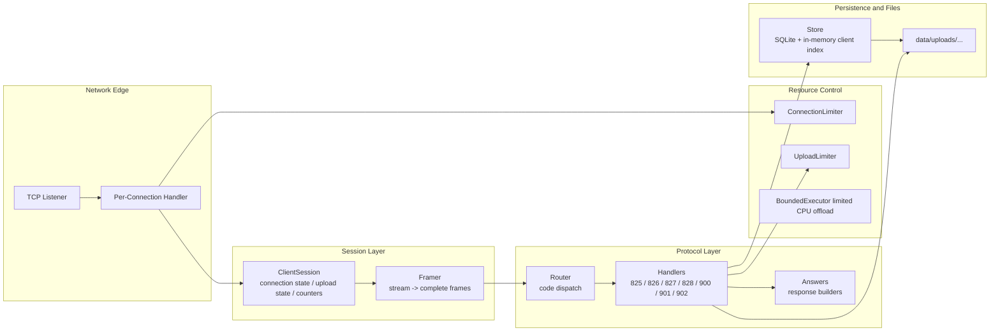

# Server Design

## 1. Purpose and Scope

The server is the stateful backend of the secure file transfer system. It accepts TCP connections from protocol-aware clients, parses a custom binary protocol, maintains per-connection session state, performs registration and key-exchange flows, receives encrypted file uploads in chunks, decrypts uploads incrementally, writes plaintext to temporary files, validates upload completion, and persists durable metadata in SQLite. The current server is implemented in Python on top of `asyncio`, with explicit admission control for both connections and uploads.

The current scope includes:
- request handling for registration, public-key submission, relogin, chunked encrypted upload, and CRC result handling
- structured logging
- protocol framing and routing
- server-side limits and timeout handling
- SQLite-backed persistence
- upload lifecycle tracking
- connection limiting and upload backpressure
- load-testing and plotting tooling for performance analysis
- Stage 8 benchmark timing breakdowns for client-observed protocol phases
- load-test RSA key pooling to avoid benchmark-runner crypto overhead
- automatic cleanup of benchmark-created upload files
- Stage 7 server-identity handshake using `829`, `1608`, and `830`
- persistent server RSA identity key generation/loading
- router gating that rejects application requests before handshake completion
- signed AES key responses (`1602` / `1605`) bound to the Stage 7 handshake transcript
- streaming server-side upload processing for request `828`
- incremental AES-CBC decryption with EOF-only PKCS#7 unpadding
- temporary upload files and atomic finalization with `os.replace`
- incremental CRC32 calculation over decrypted plaintext
- control-plane request burst limiting that excludes upload data-plane chunks

The current scope does not include:
- multi-node deployment
- external databases
- distributed queues
- resumable uploads across reconnects
- a production-grade authentication model beyond the implemented protocol flows

## 2. High-Level Architecture

At a high level, the server listens for TCP connections, creates a dedicated `ClientSession` object per connection, incrementally frames incoming bytes into complete protocol frames, routes each frame by request code, executes the matching handler, and sends binary protocol responses back to the client. The data plane is split into network/session handling, protocol dispatch, business logic handlers, durable metadata persistence, and admission control. Upload processing is now handled incrementally during 828 packet handling instead of buffering the full ciphertext and finalizing it in one large operation.

The startup path initializes configuration, logging, SQLite storage, the upload limiter, the connection limiter, and the bounded executor before opening the listening socket. On shutdown, it closes the listener, shuts down the executor, and closes SQLite cleanly. This keeps resource ownership centralized in the server entrypoint and avoids scattering global initialization logic across handlers.

### Protocol Frame Shape

The server operates on a strict binary request frame format:

```text
Request:
[16B client_id][1B version][2B code][4B payload_size][payload]

Response:
[1B version][2B code][4B payload_size][payload]
```

On the server side, framing is handled incrementally from the TCP stream, and routing extracts the request code and payload only after a full frame is available.




## 3. Major Components

### 3.1 Server Entrypoint

`server_async.py` is the orchestration layer. It loads runtime configuration, initializes infrastructure objects, starts the TCP server with `asyncio.start_server`, and defines `handle_client`, which owns the connection lifecycle from accept to disconnect. It also enforces idle and upload inactivity timeouts, manages connection admission and release, and performs disconnect cleanup, including releasing upload slots and resetting transfer state when needed.

### 3.2 Session Model

Each accepted connection gets a `ClientSession` instance. The session holds per-connection runtime state such as byte counters, framing state, request correlation identifiers, timeout timestamps, upload lifecycle fields, expected packet numbers, the current upload IV, AES-CBC decrypt state for the active upload, temporary upload file state, incremental CRC32 state, and references to shared infrastructure like the store and upload limiter. This isolates connection-local state and avoids using global mutable state for in-flight protocol handling.

The session also centralizes common behaviors such as sending framed responses, marking activity, tracking good and bad frames, recording upload progress, releasing upload slots, and resetting transfer state. That makes cleanup predictable and reduces the risk that one handler forgets to clear upload-related state after an error path.

Stage 7 also adds handshake state to each session:

- `handshake_verified`
- `client_nonce`
- `server_nonce`
- `security_version`
- `server_identity_key`

This state ensures that application-level handlers are not reachable until the server-identity handshake has completed.

### 3.3 Framing Layer

The `Framer` is responsible for stream-to-frame extraction. It buffers raw bytes across reads, waits until at least a full header is available, reads the declared payload size from the header, validates it against a maximum payload size, and emits complete frames only when enough bytes have arrived. It does not interpret payload semantics. This keeps transport framing separate from protocol business logic.

### 3.4 Router

The router parses the binary frame header, assigns a per-request ID for logging correlation, validates minimum frame structure, extracts the request code and payload, and dispatches to the corresponding request handler. Unknown codes and malformed frames are handled as protocol errors and trigger `response 1607`. The router is the narrow control point between low-level frame parsing and request-specific business logic.

For Stage 7, the router also enforces handshake gating. Before `handshake_verified` is true, only `829 CLIENT_HELLO` and `830 CLIENT_HANDSHAKE_ACK` are allowed. After handshake completion, additional handshake messages are rejected and normal application requests are allowed.

### 3.5 Request Handlers

The `handlers` module implements the core protocol operations:
- `829` handles `CLIENT_HELLO`, validates the security version, client nonce, and flags, generates a server nonce, signs the handshake transcript, and returns `1608`
- `830` handles `CLIENT_HANDSHAKE_ACK` and marks the session handshake as complete after validating protocol order
- `825` creates a new registered client if the username is not already present
- `826` validates the client identity and public key, stores the key, generates a fresh AES key, encrypts it with RSA-OAEP, and returns it
- `827` supports relogin for an existing user with a stored valid public key
- `828` handles encrypted file upload in chunks, including IV setup, header validation, ordering validation, slot acquisition, streaming AES-CBC decryption, temporary file writing, incremental CRC calculation, final padding validation, atomic file finalization, and CRC response generation
- `900`, `901`, and `902` finalize the upload record depending on CRC outcome

A notable design choice is that upload handling is stateful and split across the session lifecycle rather than implemented as a single stateless request. `packet 0` seeds the IV and expected upload metadata. `packet 1` acquires an upload slot, creates the upload record, initializes AES-CBC decrypt state, and opens a temporary upload file. Subsequent packets are validated, decrypted incrementally, and written to the temporary file in order. The final packet removes PKCS#7 padding, validates plaintext length, atomically replaces the final output path, and returns `1603` with the computed server CRC.

### 3.6 Response Builder

The `answers` module is the binary response builder. It constructs response frames with the protocol response header format and sends response codes 1600 through 1608 with the expected payload structure. It also updates `last_seen` where appropriate and logs recent activity per client.

`1608 SERVER_HELLO` carries the server nonce, server public identity key, and RSA signature needed for client-side server identity verification.

For Stage 7 `security_version = 1`, `1602` and `1605` also include an AES key binding signature. The signature is produced by the server identity key and covers the security version, client nonce, server nonce, client ID, response code, and encrypted AES key.

### 3.7 Persistence Layer

The `Store` wraps SQLite access and owns durable metadata for clients and uploads. It initializes the schema, enables WAL mode, keeps a `Clients` table and an `Uploads` table, and exposes operations for client registration, public key storage, AES key updates, last-seen timestamps, upload record creation, upload completion, and upload failure transitions.

The store also maintains in-memory indices keyed by `client_id_hex` and `username`. These are loaded from SQLite at initialization and updated write-through on relevant mutations. This makes hot-path client lookup effectively memory-based while preserving SQLite as the durable source of truth.

### 3.8 Admission Control

There are two separate admission-control mechanisms.

- `ConnectionLimiter` caps total active connections and active connections per IP. It uses an `asyncio.Lock` to serialize updates to its counters and returns explicit rejection reasons such as `server_full` or `per_ip_limit`.

- `UploadLimiter` caps the number of concurrent active uploads. The upload handler acquires a slot when `packet 1` starts the actual upload body and releases it on completion or failure. This is explicit backpressure rather than passive overload behavior.

### 3.9 Bounded CPU Offload

`BoundedExecutor` remains part of the server infrastructure for limiting CPU-heavy work when needed. Earlier upload handling used it for full-file finalization after accumulating ciphertext in memory. Stage 7 upload streaming moved the upload hot path away from full-file finalization: decryption, CRC calculation, and file writing now happen incrementally as 828 chunks arrive.

This reduces peak memory pressure and avoids scheduling one large finalization job per upload. Future CPU-heavy operations can still use the bounded executor when offload is justified.

### 3.10 Logging

Logging is structured around a base server logger and a session-aware logger adapter that injects `connection_id` and `request_id` into log records. This provides enough correlation to trace a connection and individual requests without introducing a separate observability stack.

## 4. Request and Data Flows

### 4.1 Stage 7 Server-Identity Handshake

Before registration, relogin, key exchange, upload, or CRC completion, the server requires the Stage 7 handshake.

The flow is:

1. Client sends `829 CLIENT_HELLO`
2. Server validates the payload
3. Server generates a fresh `server_nonce`
4. Server sends `1608 SERVER_HELLO` containing:
   - security version
   - server nonce
   - server public identity key
   - signature over the handshake transcript
5. Client verifies the signature and trust model
6. Client sends `830 CLIENT_HANDSHAKE_ACK`
7. Server marks `handshake_verified = true`

Only after this point does the router allow application-level requests such as `825`, `826`, `827`, `828`, `900`, `901`, and `902`.

### 4.2 Registration Flow

A new client sends `request 825` with a null-terminated username. The handler strips and validates the username, checks whether it already exists in the store, creates a new client record if not, and returns `response 1600` containing the persistent 16-byte client ID. If the username already exists, the handler returns 1601. The client ID is therefore server-issued and stable across future sessions.

### 4.3 Public Key Submission and AES Bootstrap

After registration, the client sends `request 826` containing its username and a Base64-encoded RSA public key in DER form. The server verifies that the supplied client ID exists, that the username matches the one stored for that client ID, that the key decodes correctly, that it is a public key rather than a private key, that it is 2048 bits, and that the exponent is valid. The server then stores the public key, generates a fresh 32-byte AES key, stores that AES key in Base64 form, encrypts it with RSA-OAEP, and returns it in `response 1602` together with the client ID.

For Stage 7 connections, the encrypted AES key is returned in a bound response format. The response includes the client ID, encrypted AES key length, encrypted AES key, signature length, and signature. The signature binds AES key delivery to the completed Stage 7 handshake.

### 4.4 Relogin Flow

A returning client can use `request 827` with its client ID and username. The server verifies that the username exists, that it maps to the same stored client ID, and that a valid stored RSA public key is present. If so, it generates a new AES key, stores it, encrypts it with the stored public key, and returns it in `response 1605`. If the user does not exist or the stored key is invalid, the server responds with 1606. This preserves the stable client identity while rotating the session AES key.

### 4.5 Upload Flow

The upload flow is the most stateful part of the server.

The client sends `request 828` packet `0` first. Packet `0` carries upload metadata and the per-file IV. The server uses this packet to initialize transfer state, store the IV, and record the expected number of packets, total ciphertext size, and original plaintext size. No upload slot is acquired yet at this stage.

When packet `1` arrives, the server acquires an upload slot from the `UploadLimiter`. If no slot is available, the server returns `response 1607` with the message `server busy: too many concurrent uploads` and rejects the upload early. If a slot is acquired, the server marks the upload active, creates an upload record in SQLite with status `in_progress`, initializes AES-CBC decrypt state, creates a temporary upload file, and begins streaming upload processing.

For each packet, the server validates that the client identity has not changed mid-upload, that the IV has already been received, that packet ordering is correct, that the total packet count and size values match the values established by packet `0`, and that the chunk size does not exceed configured bounds.

Ciphertext is not accumulated into a full in-memory file buffer. Instead, each ciphertext chunk is decrypted incrementally using continuous AES-CBC state. The server writes decrypted plaintext to the temporary file and updates CRC32 incrementally. To handle PKCS#7 safely, the server keeps a small pending plaintext tail and only removes padding when the last packet arrives.

On the last packet, the server confirms that the total received ciphertext size matches the expected content size, validates final PKCS#7 padding, verifies that the plaintext size matches `original_plain_size`, closes the temporary file, atomically replaces the final output file path, stores the output path and CRC in the session, and sends `response 1603` back to the client.

### 4.6 CRC Outcome Flows

After receiving 1603, the client responds with one of three outcomes.

- Request `900` means the client agrees that the CRC is valid. The server verifies the upload session fields, marks the upload record `completed`, stores the final path and CRC, returns `1604`, releases the upload slot, and resets transfer state.

- Request `901` means CRC mismatch. The server marks the upload record as `crc_mismatch`, releases the upload slot, and resets transfer state without returning `1604`.

- Request `902` means CRC mismatch after the client exhausted retries. The server marks the upload record as `failed`, returns `1604`, releases the upload slot, and resets transfer state.

## 5. Persistence Model

The persistence model is intentionally split between durable metadata and transient connection state.

- Durable client metadata lives in SQLite in the `Clients` table. Each client record includes a persistent `client_id_hex`, a unique username, the stored RSA public key in DER form, the latest AES key in Base64, and timestamps for creation and last-seen activity. Durable upload metadata lives in the `Uploads` table and includes the owning client, file name, stored path, original plaintext size, ciphertext size, computed server CRC, status, failure reason, and timestamps.

- Transient state lives in `ClientSession`. This includes the live socket writer, framing buffer, current IV, AES-CBC decrypt state, temporary upload file path/handle, pending plaintext tail for final padding handling, current upload slot ownership, expected packet numbers, upload timing, the active upload AES key, and upload completion artifacts that have not yet been committed through `900`, `901`, or `902`. This state is connection-scoped and is discarded on disconnect or reset.

- The store keeps an in-memory client index keyed by both client ID and username. This is not a second source of truth. It is a read optimization layered on top of SQLite and kept in sync via write-through updates. The benefit is that request handlers can resolve client identity quickly on the hot path without repeatedly issuing SQL lookups for every frame.

- Uploaded file contents themselves are not stored in SQLite. The plaintext file is written to disk under `data/uploads/<username>/<file_name>`, while SQLite stores metadata and lifecycle state only. This keeps large file contents out of the relational store while still preserving queryable operational metadata.

### 5.1 Upload Lifecycle States

The upload lifecycle is persisted explicitly. An upload record is created with status `in_progress` when the server accepts packet 1 and acquires an upload slot. It transitions to `completed` on `request 900`, to `crc_mismatch` on `request 901`, and to `failed` on `request 902` or on internal failure paths where the handler records upload failure before reset. This makes failure modes visible beyond in-memory logs.

## 6. Concurrency Model

The server uses an asyncio event loop for connection handling and network IO. Each client connection is handled by the same high-level async flow in `handle_client`, which performs framed reads with timeout checks, routes complete frames, and cleans up on disconnect. This model is well suited for many mostly IO-bound concurrent connections.

Per-connection state is isolated through `ClientSession`. Concurrent clients do not share upload progress, IVs, packet counters, or request IDs. The primary shared mutable components are the store, the connection limiter, the upload limiter, and the bounded executor, each with a narrow responsibility boundary.

The server uses explicit admission control instead of relying only on timeouts or queue growth. Connection concurrency is bounded globally and per IP. Upload concurrency is bounded separately. These are distinct limits because connection count and active upload count stress different resources. An idle connection is much cheaper than an active upload that performs streaming decryption, file IO, CRC calculation, and upload lifecycle tracking.

Stage 7 upload streaming reduces the need for a large CPU-bound finalization step by processing ciphertext incrementally as packets arrive. The bounded executor remains available for future CPU-heavy work, but upload finalization no longer depends on accumulating full ciphertext and offloading one large decrypt/write/CRC job.

## 7. Validation, Error Handling, and Abuse Resistance

The protocol layer is strict by design. The framer enforces a maximum payload size before frame extraction. The router checks for missing headers, truncated payloads, and unknown request codes. Handlers then perform request-specific validation such as UTF-8 decoding checks, null terminator checks, identity matching, RSA key validation, packet order validation, size limits, and upload state consistency checks. Invalid protocol behavior generally returns `1607` and aborts or resets the active flow.

For uploads specifically, the server validates total packet counts, per-chunk limits, declared original and ciphertext sizes, IV presence, monotonic packet order, and cumulative ciphertext size. These checks protect both correctness and resource consumption. The server also sanitizes the incoming filename with `os.path.basename`, which reduces the risk of path traversal through user-provided names.

Timeouts are also part of the protection model. The server distinguishes idle timeout from upload inactivity timeout. A stalled connection can therefore be cleaned up differently from a stalled upload, and active uploads that stop making progress are cut off rather than consuming resources indefinitely.

The backpressure model is explicit. When upload capacity is exhausted, the server rejects new uploads with a structured protocol error instead of allowing latency explosion, uncontrolled buffering, or process instability. The same principle applies to connection admission through the connection limiter.

## 8. Key Design Decisions and Tradeoffs

### 8.1 Python asyncio Server

The server is written in Python with asyncio, which is a pragmatic choice for a protocol-heavy system that benefits from fast iteration, readable control flow, and easy testing. This improves development speed and maintainability, especially for request routing, validation logic, and observability tooling. The tradeoff is that CPU-heavy work must be isolated carefully, and the server is not optimized for raw compute throughput by default. That tradeoff is mitigated here with bounded offload for upload finalization.

### 8.2 SQLite for Durable Metadata

SQLite is used as the persistence backend because the server needs real durability and lifecycle tracking, but does not yet need the operational complexity of a client-server database. It is enough for a single-node engineering project, keeps local setup simple, and still supports proper tables, transactions, and queryable state. The tradeoff is limited horizontal scalability and coarser DB concurrency compared to larger systems.

### 8.3 In-Memory Client Index on Top of SQLite

The store maintains an in-memory client index for hot-path lookups while preserving SQLite as the durable store. This is a good middle ground: handlers get fast identity lookups in practice, but the system does not abandon durable metadata. The tradeoff is duplicated state that must remain synchronized. The current implementation addresses that by loading the index at startup and updating it in write-through fashion on mutating operations.

### 8.4 Backpressure Instead of Best-Effort Overload

The server does not accept unlimited uploads and hope that timeouts will resolve overload later. It explicitly rejects work once concurrent upload capacity is exhausted. This is the correct choice for a system where upload finalization has real CPU and IO cost. The tradeoff is that some clients receive explicit rejection under load, but that is preferable to unbounded queueing, memory growth, or degraded service for all clients.

### 8.5 Separate Connection and Upload Limits

The design separates connection limiting from upload limiting because these are different resource domains. A connection can exist without consuming the same cost as an active upload. Keeping the limits separate gives finer control over overload behavior and makes later performance analysis more interpretable. The tradeoff is slightly more lifecycle complexity during cleanup.

### 8.6 Bounded Executor Instead of Inline Finalization

Upload finalization is not done inline in the event loop. Decryption, padding removal, file writing, and CRC computation are offloaded to a bounded executor. This avoids stalling unrelated clients during large uploads. The tradeoff is extra coordination complexity between async code and threaded work, but it is justified because upload finalization is the most CPU-sensitive path in the server.

### 8.7 Strict Validation and `1607` Error Signaling

The server chooses strict protocol validation with explicit error signaling instead of permissive recovery. That makes failure semantics clearer, keeps the session state machine simpler, and reduces ambiguity after malformed input. The tradeoff is that clients must treat protocol errors as terminal for the current flow, which is appropriate for a binary protocol carrying cryptographic and upload state.

## 9. Configuration Model

Runtime behavior is controlled through `Config.load()`, which combines defaults with environment-variable overrides and an optional port.info file. Configurable parameters include host, port, data path, log level, idle timeout, upload inactivity timeout, maximum file size, maximum packet count, maximum chunk size, maximum payload size, read timeout, maximum concurrent uploads, global connection cap, per-IP connection cap, worker thread count, and max in-flight CPU tasks. This provides enough knobs for local testing, overload experiments, and behavior tuning without requiring code changes.

## 10. Observability and Performance Tooling

The project includes dedicated load-testing, benchmark-comparison, and plotting utilities, which are part of the server design story because they shape how capacity and bottlenecks are analyzed.

`load_test.py` supports scenarios for register, relogin, upload, mixed, churn, idle, and idle_upload. It records success, failure, rejection, latency percentiles, throughput, and sampled process metrics such as RSS, CPU usage, and thread count. For mixed and hybrid scenarios it also records per-operation summaries, which is important because overall averages can hide the fact that one operation dominates the bottleneck.

Stage 8 extended this tooling in several important ways.

First, the load runner was updated for Stage 7 protocol compatibility. Benchmark clients now perform the required `829 CLIENT_HELLO` / `1608 SERVER_HELLO` / `830 CLIENT_HANDSHAKE_ACK` flow before sending application-level requests. The runner also understands the Stage 7 bound AES key response format used by `1602` and `1605`.

Second, the load runner now records client-observed timing breakdowns for important protocol phases. Upload runs can include timing for connection and handshake, registration, RSA key generation or RSA key-pool selection, AES key exchange, RSA decrypt, client-side encryption preparation, upload packet transmission, and CRC confirmation. This makes it easier to distinguish server upload cost from benchmark-runner setup overhead.

Third, the load runner supports RSA key pooling. Without key pooling, upload benchmarks generated RSA-2048 keypairs inside each upload worker. That polluted the measurement with client-side CPU work and made upload latency look much worse than the server upload path itself. With a pre-generated RSA key pool, benchmark runs better isolate the upload path and reveal the actual cost of 828 packet transmission and server-side streaming processing.

Fourth, the load runner now uses run-specific upload filenames and cleans up benchmark-created upload files after the run. This keeps local upload directories from accumulating synthetic benchmark artifacts while preserving the structured JSON benchmark reports.

`compare_results.py` provides a CLI for comparing two benchmark JSON reports. It compares matching load stages and reports changes in latency, throughput, success/rejection/failure counts, and per-phase timing breakdowns. This supports before/after analysis for changes such as RSA key pooling or upload chunk-size tuning.

`plot_results.py` turns run reports into graphs for latency, throughput, outcome rates, CPU, RSS, upload-size comparisons, and mixed-workload per-operation comparisons. Stage 8 extends it with comparison-oriented plotting modes. The `stage8-compare` mode generates before/after plots from two Stage 8 benchmark JSON reports, including latency, rejection/failure outcomes, and per-phase timing breakdowns. The `stage6-vs-stage8` mode generates behavioral comparison plots between the Stage 6 upload baseline and the Stage 8 post-streaming upload baseline. This comparison is intentionally framed as behavioral rather than a strict apples-to-apples microbenchmark because Stage 7 changed the handshake, AES key binding, and upload pipeline.

Stage 8 benchmark findings currently show that the initial post-Stage-7 upload numbers were polluted by load-generator RSA key generation. After adding timing breakdowns and RSA key pooling, 1MB upload measurements dropped from multi-second values to sub-second values in the tested scenarios, while the upload packet phase stayed roughly stable. This indicates that RSA pooling cleaned the measurement rather than changing server upload behavior.

The generated Stage 8 plots support the same conclusion visually. The RSA key-pool plots show a large drop in end-to-end latency while `upload_packets_ms` remains roughly stable, confirming that the key pool removes benchmark-runner overhead rather than changing the server upload hot path. The Stage 6 vs Stage 8 upload plots show cleaner overload behavior, lower RSS growth, lower CPU peak, and higher measured throughput in the tested 1MB upload scenario.

A later Stage 8 or Stage 9 optimization candidate is size-aware upload backpressure. The current upload limiter is concurrency-based and treats all uploads as equal. Earlier Stage 6 results showed that larger files create more RSS and CPU pressure, and Stage 8 confirms that upload remains the main resource-sensitive path after streaming. A future limiter could account for active upload bytes in addition to active upload count.

## 11. Current Architectural Findings

The current architecture is built around the assumption that upload handling is the dominant cost center, while registration and relogin are lighter control-plane operations. The presence of separate upload backpressure, bounded CPU finalization, upload-specific lifecycle tracking, and per-operation benchmarking reflects that assumption directly.

Another clear architectural property is controlled failure under pressure. Rather than crashing or relying only on socket-level timeout behavior, the server exposes overload through explicit rejections, structured lifecycle cleanup, and persistent upload status transitions. That is a stronger design for a protocol server than best-effort overload behavior.

## 12. Limitations and Future Work

This server is already structurally solid for a single-node engineering project, but several directions remain open.

A deeper observability layer would still help. Stage 8 improved benchmark-side observability with timing breakdowns, RSA key pooling, upload artifact cleanup, and JSON comparison tooling. However, the server itself still does not expose structured metrics endpoints, active upload state, queue-depth telemetry, protocol error counters, or detailed server-side internal timings for phases such as frame parsing, handler execution, SQLite interaction, upload packet processing, temporary file writes, and final atomic replacement.

The in-memory client index is a sensible optimization, but its effect has not yet been isolated by dedicated profiling. A future step would be to measure lookup cost, DB interaction frequency, and end-to-end impact under realistic mixed workloads before deciding whether more caching or indexing is justified. The current code already contains the index, so the next move should be evidence-driven evaluation, not optimization by assumption.

Upload admission control could also become more nuanced. The current upload limiter is based on the number of active uploads. That keeps overload behavior simple and predictable, but it does not account for the fact that larger uploads consume more CPU, disk IO, and memory pressure over time. A future size-aware upload limiter could combine active upload count with active upload byte cost.

Upload persistence could also evolve. Today, metadata is persisted, while in-progress upload stream state remains session-bound until completion. If resumable uploads or reconnect continuation were needed, the protocol and persistence model would need explicit upload sessions, durable chunk-level state, and recovery semantics beyond the current per-session design.

Finally, the current architecture is intentionally single-process and single-node. A future alternative implementation could re-evaluate the server in C++ or another systems-oriented runtime, but that would be a separate architecture exercise rather than a direct next step. The current Python server already demonstrates sound boundaries, backpressure, protocol validation, and persistence modeling.

## 13. Summary

The server architecture is built around a clear separation of concerns: async network handling, framed protocol parsing, request-specific business logic, durable metadata persistence, explicit admission control, and bounded CPU offload. The most important architectural property is that the server treats uploads as the dominant resource-sensitive path and designs around that fact with session state, strict validation, upload lifecycle persistence, upload backpressure, and bounded finalization. The result is a backend that is small enough to understand end to end, but mature enough to discuss seriously in terms of concurrency, durability, overload behavior, and tradeoffs.