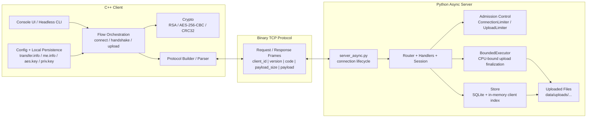
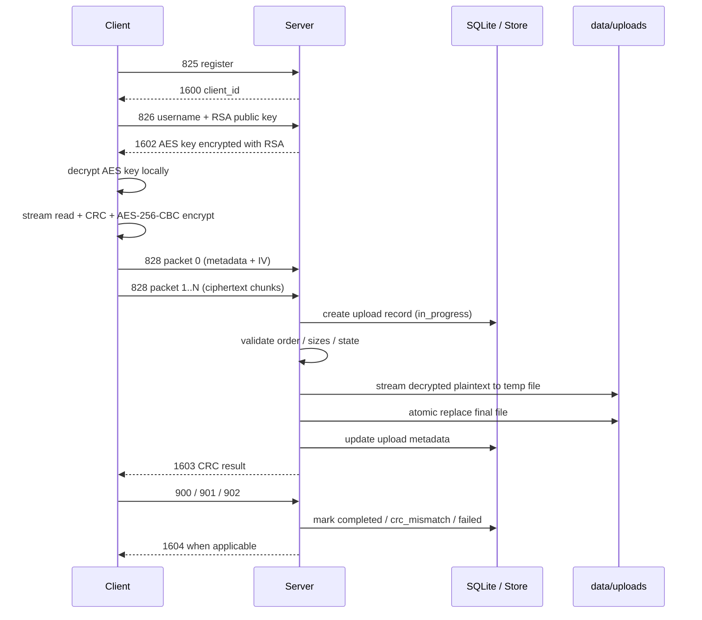

# System Design

## 1. Purpose and Scope

This project implements a secure file transfer system composed of a C++ client and a Python `asyncio` server communicating over a custom binary TCP protocol. The system is designed to support registration, relogin, key exchange, encrypted file upload, CRC-based completion, and durable server-side metadata tracking.

The implementation focuses on protocol correctness, cryptographic separation of responsibilities, explicit persistence boundaries, controlled resource usage, and architecture clarity. It is intended as a serious engineering project rather than a production deployment.

The current scope includes:
- a C++ client for connection, handshake, encryption, upload, and local persistence
- a Python `asyncio` server for request handling, validation, upload finalization, and metadata persistence
- a custom binary request/response protocol
- RSA-based key bootstrap and AES-based file encryption
- chunked encrypted file upload
- CRC-based integrity confirmation
- server-side SQLite persistence
- local client identity and key persistence
- observability, benchmarking, and benchmark-comparison tooling
- post-Stage-7 performance observability and timing breakdowns
- benchmark hygiene for cleaning up synthetic load-test upload artifacts
- authenticated server identity handshake before application-level protocol flows
- TOFU and optional pinned server fingerprint trust modes

The current scope does not include:
- distributed deployment
- multi-node coordination
- resumable uploads across reconnects
- platform-native secure key storage
- GUI-based operation
- a production-grade authentication and authorization model beyond the implemented protocol flows

## 2. System Overview

At a high level, the client loads runtime configuration and local identity material, connects to the server, and executes either registration or relogin. The server validates the request, establishes or restores client identity, and delivers a server-generated AES key encrypted under the client's RSA public key. The client decrypts that AES key locally and uploads files through a streaming encryption pipeline. It reads plaintext incrementally, computes CRC32 incrementally, encrypts with continuous AES-256-CBC state, and sends ciphertext in protocol-compliant 828 chunks. The server decrypts those chunks incrementally, writes plaintext to a temporary file, computes CRC32 incrementally, atomically finalizes the output file, and uses a final CRC exchange to conclude the upload lifecycle.

Before registration, relogin, AES key bootstrap, or upload requests, the client and server now execute a Stage 7 server-identity handshake. The server proves ownership of a persistent RSA identity key by signing a transcript containing both client and server nonces. The client verifies the signature and then validates the server fingerprint using either TOFU or an optional pinned fingerprint.

This creates a clear end-to-end separation:
- the client owns local identity, local encryption, and upload initiation
- the server owns protocol enforcement, upload admission, finalization, and durable metadata

## 3. High-Level Architecture

The system is composed of three major boundaries:
- a C++ client
- a shared protocol boundary over TCP
- a Python `asyncio` server

The client is responsible for local orchestration, persistence, cryptographic preparation, and request emission. The protocol boundary defines the binary frame format and request/response semantics. The server is responsible for framed request handling, validation, admission control, persistence, and upload completion.

## 4. End-to-End Flows

### 4.1 Registration and Identity Bootstrap

On first use, the client sends request `825` with its username. The server returns response `1600` with a persistent client ID. The client then generates an RSA keypair and sends request `826` with its public key. The server validates that key, generates a fresh AES key, encrypts it under the client's RSA public key, and returns it in response `1602`. The client decrypts that AES key locally and persists it.

This flow establishes:
- server-issued stable identity
- client-owned private key material
- server-issued symmetric encryption material for uploads

### 4.2 Relogin and Session Re-establishment

On later runs, the client attempts relogin using its persisted identity. It sends request `827`, and the server either restores the session by returning a fresh AES key in response `1605`, or forces the client into a recovery path if relogin cannot proceed.

This keeps identity stable across sessions while allowing session encryption material to rotate.

### 4.3 Secure File Upload Flow

Once handshake is complete and the client holds an AES key, upload uses the existing 828 wire protocol with a streaming implementation.

The client sends packet `0` with metadata and a fresh per-file IV. It then reads plaintext incrementally from disk, updates CRC32 incrementally, encrypts with continuous AES-256-CBC state, applies PKCS#7 padding only at end-of-file, packetizes ciphertext, and sends packets `1..N`.

The server validates the upload metadata, packet order, and size limits. It decrypts ciphertext chunks incrementally with continuous AES-CBC state, writes plaintext to a temporary file, updates CRC32 incrementally, validates final padding and plaintext size on the last packet, and atomically replaces the final uploaded file path.

The key architectural point is that plaintext is never sent over the wire, and neither side needs to hold the full plaintext or full ciphertext in memory.

### 4.4 CRC Validation and Completion

After receiving `1603`, the client decides whether to confirm or reject the transfer result:
- request `900` confirms CRC agreement
- request `901` indicates CRC mismatch
- request `902` indicates CRC mismatch after retry exhaustion

The server uses these requests to finalize the upload lifecycle in persistent metadata.

## 5. Component Boundaries

### 5.1 Client Responsibilities

The client is responsible for:
- loading runtime configuration
- managing local identity and key material
- generating and storing RSA private key material
- decrypting the server-issued AES key
- encrypting file contents before upload
- building protocol-compliant request frames
- interpreting response frames
- driving upload completion based on CRC outcome
- exposing interactive and headless execution modes

### 5.2 Server Responsibilities

The server is responsible for:
- accepting and managing TCP connections
- framing the byte stream into protocol requests
- validating request structure and semantics
- issuing and persisting stable client identity
- validating public keys and delivering AES key material
- enforcing connection and upload limits
- reassembling and finalizing uploads
- persisting client and upload metadata
- tracking upload lifecycle outcomes

### 5.3 Shared Protocol Boundary

The client and server communicate through a shared binary protocol boundary. This boundary defines:
- frame structure
- request and response codes
- payload semantics
- upload packet ordering
- CRC completion semantics

This shared boundary is the contract that lets the client and server evolve as separate components while still interoperating correctly.

## 6. Persistence Model

### 6.1 Client-Side Persistence

The client persists identity and key material locally using files such as `me.info`, `aes.key`, and `priv.key`. This allows relogin, RSA private key reuse, and reuse of decrypted symmetric material across runs.

### 6.2 Server-Side Persistence

The server persists durable metadata in SQLite. Client records include identity and key-related metadata, while upload records capture file metadata, lifecycle status, failure reasons, and completion information.

### 6.3 Transient vs Durable State

The system deliberately separates transient and durable state:
- on the client, runtime socket and flow state are transient, while identity and keys are durable
- on the server, per-connection upload/session state is transient, while client and upload metadata are durable

This separation simplifies recovery behavior and keeps lifecycle boundaries explicit.

## 7. Security Model

The system's security model is based on a split responsibility design:
- the server issues stable client identity
- the client generates and keeps its RSA private key locally
- the server generates the AES session key
- the AES key is delivered encrypted under the client's RSA public key
- files are encrypted on the client before transport
- each file uses a fresh IV
- CRC32 is used to confirm end-to-end transfer integrity
- strict protocol validation is used to reject malformed or inconsistent input
- server identity is authenticated before AES key establishment
- the server signs the Stage 7 handshake transcript with a persistent RSA identity key
- the client validates the server fingerprint using TOFU or optional pinned mode
- application-level requests are rejected until the handshake completes
- AES key responses are signed and bound to the Stage 7 handshake transcript before the client accepts them

This model keeps plaintext file contents off the wire and avoids sharing private key material with the server.

## 8. Concurrency and Resource Control

The client is intentionally simple in execution behavior. It does not attempt concurrent uploads from a single process and generally operates as a sequential flow controller.

The server, by contrast, is explicitly concurrent. It uses `asyncio` for connection handling, per-connection session isolation, and admission-control mechanisms to prevent overload:
- connection limiter
- upload limiter
- bounded executor for CPU-heavy upload finalization

This gives the overall system an asymmetric but intentional structure:
- simple deterministic client behavior
- controlled multi-connection server behavior

## 9. Key Design Decisions and Tradeoffs

Several major decisions define the architecture.

Using a C++ client makes sense for explicit binary protocol handling, local file processing, and cryptographic integration, but it increases implementation complexity.

Using a Python `asyncio` server improves iteration speed, readability, and testability, but requires careful handling of CPU-heavy work.

Using a custom binary protocol gives strong control over framing and payload semantics, but requires the protocol contract to be maintained carefully.

Using SQLite for server metadata persistence provides durable storage with low operational complexity, but does not target distributed scale.

Using file-based local persistence on the client keeps the project portable and easy to inspect, but is weaker than platform-native secure credential storage.

Using explicit server-side backpressure is preferable to best-effort overload behavior, but means the system intentionally rejects work under pressure instead of absorbing all requests.

## 10. Observability and Performance Findings

The project includes dedicated benchmarking and analysis tooling focused primarily on server behavior under load. These tools evaluate latency, throughput, rejection rates, failure rates, CPU usage, RSS growth, and per-operation behavior under scenarios such as `register`, `relogin`, `upload`, `mixed`, `churn`, and `idle_upload`.

Stage 6 established the first performance analysis baseline and identified upload handling as the dominant cost path. Registration and relogin behaved more like control-plane operations, while upload traffic drove the main resource and capacity constraints. This validated the decision to treat upload handling as a separately controlled resource domain on the server.

Stage 7 changed the upload implementation substantially by moving from full-file plaintext/ciphertext buffering to streaming upload processing. Because of that, Stage 8 re-established the performance baseline after the Stage 7 protocol and upload-pipeline changes.

Stage 8 added benchmark-side observability improvements:

- Stage 7-compatible load-test protocol flow
- parsing support for bound AES key responses
- per-phase timing breakdowns in benchmark JSON
- RSA key-pool support for cleaner upload measurements
- benchmark-created upload artifact cleanup
- benchmark JSON comparison CLI
- post-Stage-7 performance observability documentation

The most important Stage 8 finding so far is that the initial post-Stage-7 upload benchmark was polluted by client-side RSA key generation inside the load runner. After adding RSA key pooling, 1MB upload latency dropped from multi-second values to sub-second values in the tested scenarios. The upload packet phase itself stayed roughly stable, which means RSA key pooling cleaned the measurement rather than changing server upload behavior.

Stage 8 also showed that upload chunk size affects latency. Smaller chunks create more 828 packets and therefore more per-packet overhead. Among the tested chunk sizes, `64 * 1024` performed best and now matches the load-test default and the server default maximum chunk size.

The current architectural takeaway remains that upload is the dominant resource-sensitive path, but Stage 8 made that conclusion more precise. The next optimization should be evidence-driven and may include size-aware upload backpressure, richer plotting/report generation, or deeper server-side internal timing.

## 11. Limitations and Future Work

Several future directions remain open:
- no certificate-based trust authority or external CA
- TOFU remains vulnerable to MITM on the first connection
- no mutual cryptographic client authentication beyond the existing client key bootstrap flow
- controlled server identity rotation and explicit local identity reset flows
- stronger local storage beyond filesystem permissions for `priv.key` and `aes.key`
- future AEAD-based chunk upload protocol for authenticated chunks, resumability, and controlled per-chunk retry
- deployment-level abuse protection beyond application-level limits
- deeper server-side observability and internal per-phase timing
- size-aware upload backpressure based on active upload byte cost
- richer benchmark report generation and plotting for Stage 8 comparisons
- runtime metrics for active connections, active uploads, and executor saturation
- isolated profiling of the server's in-memory client index
- optional controlled parallel upload support if justified
- optional GUI client
- possible future server implementation in C++

These are future improvements, not missing correctness requirements for the current project.

## 12. Document Map

This document is the high-level architecture overview for the full system.

For component-specific detail:
- see `docs/architecture/client_design.md` for client internals
- see `docs/architecture/server_design.md` for server internals
- see `docs/protocol/spec.md` for the protocol specification
- see `docs/performance/performance_analysis.md` for benchmark findings
